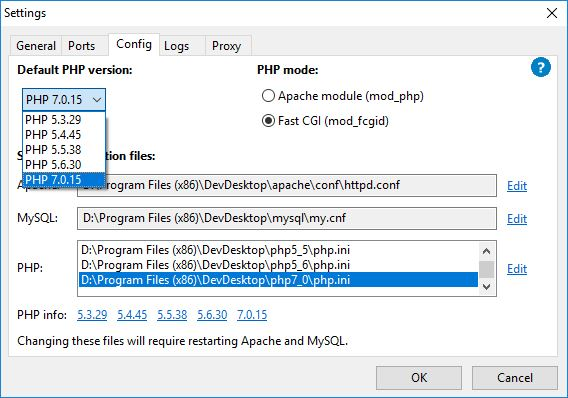

# README

This README contains the basic info of our project.

1. [How to setup your local development](#setuplocal)
2. [Development: Environment + LOGINS + PASSWORD WARNING](#develenvir)
3. [Development: Progress](#develprogr)
4. [Development: Uploading Changes](#develuploa)

## Contributors:

- Depourcq, Diederik
- De Wolf, Annelies
- De Witte, Dries
- Palacios, Núria

## 1. <a name="setuplocal"></a>How to setup your local development

### Prerequisites

1. Install Acquia Dev Desktop [download here](https://dev.acquia.com/downloads)
2. Windows users: Install Gitbash [download here](https://git-for-windows.github.io)

### Cloning and installing our Drupal8 from latest version

1. **Open Gitbash** in the destination folder you want the Drupal8 to be saved. In our example we used ``D:\Drupals`` (in Gitbash noted as ``/d/Drupals``)

 

2. **Clone the Github repository** with the command below and press enter

 ```
 git clone https://github.com/diederikHG/3TINprojectebusiness.git
 ```

 

3. **Open Acquia Dev Desktop 2**
4. Select **php7.0.15 as default** (in Preferences - Config) if you haven't already and press ok

 

5. Select **Import Local Drupal Site**

 

6. **Configure the import settings** and press OK

 

 - ***Local codebase Folder***: Change it to the ```drupal8```-folder in the cloned repository
 - ***Local sitename***: ```VRTMediaArchive```
 - ***Use PHP***: must be set to ```7.0.15```
 - ***Database***: Select ```Start with MySQL database dump file```
 - ***Dump file***: Select the **most recent** vrtmediaarchive.sql in the 'SQL'-folder. You don't wont to import an older version of the database if you cloned the most recent repo.
 - ***New database name***: ```vrtmediaarchive```

7. Acquia will add the Drupal 8 with the database
- In Windows some antivirus programs will block Acquia from writing to your HOSTS file. Briefly deactivate it ONLY to import the website with Acquia Dev Desktop 2.
8. When Acquia Dev Desktop has done importing your website, you can open it with the links provided in Acquia.

## 2. <a name="develenvir"></a>Development: Environment

- Acquia Dev Desktop using PHP 7.0.15
- Drupal 8 login: admin
- Drupal 8 password: VRTadmin1234
- **Never use REAL PASSWORDS because it can be found in the Drupal database dump**

## 3. <a name="develprogr"></a>Development: Progress

### Kanban boards

- Sprint 2: https://trello.com/b/l74lI4yu/g010910-2210
- Sprint 3:
- Sprint 4:
- Sprint 5:

## 4. <a name="develuploa"></a>Development: Uploading Changes

**Because we work with local MySQL-databases every change in Drupal8 will imply changes in the database. To garantee a full functioning website every commit has to be preceded by a sql dump that is added to the SQL folder. After that the sql dump can be committed with the changes in Drupal 8.**
